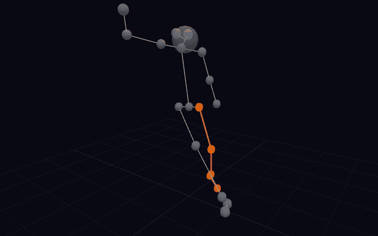

# Ajax Shot Technique Analyzer

A biomechanics analysis toolkit built at **Ajax Hackathon 26** that extracts every shot from a live Eredivisie match and scores each one using the kinematic chain principle — giving coaches and analysts a quantitative, visual breakdown of shooting technique.

Built using 3D skeleton tracking data (21 body joints per player at 25 fps) from a full 90-minute match, the project surfaces 23 shot clips with per-shot scoring, timing analysis, and an interactive 3D viewer.

<p align="center">
  
</p>
<p align="center"><em>Skeleton frozen at ball-contact frame — kicking leg (orange/red) highlighted against the neutral body</em></p>

---

## Features

### Analytics Dashboard (`/kinematics`)
- **WhipChain Gauge** — animated semicircular score (0–100) showing how efficiently a player's body converted rotation into ball speed
- **Cascade Chart** — angular velocity curves for pelvis, hip, knee, and foot across the shot window, with peak markers and ideal timing reference lines
- **Skeleton at Contact** — 3D view of the shooter's body frozen at the exact frame of ball contact
- **Ideal Skeleton Comparison** — side-by-side 3D render of the actual vs. ideal kick, with divergent joints highlighted in orange
- **Shot Strip** — fixed bottom bar for switching between all shots without losing context

### 3D Shot Viewer (home)
- Full-scale 3D pitch with all players rendered as cylinder-bone skeletons, colour-coded by team
- Ball rendered with a motion trail and bloom lighting for easy tracking
- **Gaze Overlay** — toggle to see each player's head direction vs. ball direction, colour-coded by tracking angle
- Scrub, play/pause, and reset controls

---

## How the Scoring Works

A well-executed kick works like cracking a whip: the pelvis rotates first, transferring energy to the hip, which loads the knee, which releases through the foot. Each segment should peak in rotational speed after the one above it.

We convert the 3D joint positions into rotation matrices using Gram-Schmidt orthogonalisation, then compute angular velocity via the incremental rotation vector method:

$$
\boldsymbol{\omega}_i = \frac{\log(R_{i-1}^T R_i)}{\Delta t} \quad \text{(rad/s)}
$$

The **WhipChain Score (WCS)** combines cascade correctness (60%) with foot-to-pelvis speed ratio (40%):

$$
\text{WCS} = \text{round}\left(\left(0.6 \cdot \frac{\text{correct gaps}}{3} + 0.4 \cdot \min\!\left(\frac{\omega_{\text{foot}}}{3\,\omega_{\text{pelvis}}}, 1\right)\right) \times 100\right)
$$

For each shot we also generate an **ideal skeleton**: we take the player's own kinematics, sort the four peak times into the correct cascade order, and time-warp each segment's rotation via SLERP on SO(3). Only the knee, ankle, heel, and toe change — the player's upper body and natural style stay intact.

---

## Project Structure

```
├── utils/                  # Core Python library
│   ├── kinematics.py       # Angular velocity + WhipChain score computation
│   ├── skeleton_data.py    # Joint definitions, bone connections, coordinate transforms
│   ├── detect_shot_frames.py   # Ball-acceleration + goal-angle shot detection
│   ├── compute_shot_kinematics.py
│   ├── generate_ideal_skeletons.py  # SLERP-based ideal kick generation
│   └── build_shot_parquet.py
│
├── scripts/                # One-shot data export scripts
│   ├── export_shots.py         # Parquet → JSON for 3D viewer
│   ├── export_kinematics.py    # Kinematics metrics → JSON for dashboard
│   └── export_ideal_skeletons.py
│
├── tests/
│   └── test_shot_detection_regressions.py
│
└── viz/                    # Next.js frontend
    ├── app/
    │   ├── page.tsx            # 3D shot viewer
    │   └── kinematics/page.tsx # Analytics dashboard
    └── components/
        ├── ShotScene.tsx       # React Three Fiber 3D scene
        ├── PlayerSkeleton.tsx  # Skeleton mesh renderer
        ├── Playback.tsx        # Playback controls
        ├── GazeOverlay.tsx     # Head-direction gaze rays
        └── kinematics/         # Dashboard components
```

---

## Data Format

The pipeline expects two parquet files in `data/`:

**`shots_trimmed.parquet`** — one row per frame:
- `frame_number`, `ball_exists`, `skeleton_count`, `type`, `version`
- `ball`: `{position_x, position_y, position_z, velocity_x, velocity_y, velocity_z}`
- `skeletons`: list of `{jersey_number, team, parts_count, parts: [{name, position_x, position_y, position_z}]}`

**`shots_parts.parquet`** — flat kinematics table with `frame`, `player`, `body_part`, and angular velocity columns

Body part IDs 1–21: `LEFT_EAR`, `NOSE`, `RIGHT_EAR`, `LEFT_SHOULDER`, `NECK`, `RIGHT_SHOULDER`, `LEFT_ELBOW`, `RIGHT_ELBOW`, `LEFT_WRIST`, `RIGHT_WRIST`, `LEFT_HIP`, `PELVIS`, `RIGHT_HIP`, `LEFT_KNEE`, `RIGHT_KNEE`, `LEFT_ANKLE`, `RIGHT_ANKLE`, `LEFT_HEEL`, `LEFT_TOE`, `RIGHT_HEEL`, `RIGHT_TOE`

Team codes: `1=HOME`, `2=TEAM_A`, `3=TEAM_B`, `4=REFEREE`

Field dimensions: x ∈ [−56, 56] m, y ∈ [−39, 38] m, z ∈ [0, 2.35] m (z = height)

---

## Setup

### Python pipeline

```bash
uv sync
```

Run the export scripts (requires parquet data files in `data/`):

```bash
uv run python scripts/export_shots.py
uv run python scripts/export_kinematics.py
uv run python scripts/export_ideal_skeletons.py
```

This writes JSON files to `viz/public/data/` which the frontend loads on demand.

### Frontend

```bash
cd viz
npm install
npm run dev
```

Open [http://localhost:3000](http://localhost:3000).

---

## Coordinate System

The data uses a right-handed field coordinate system. Mapping to Three.js:

| Data axis | Three.js axis | Notes |
|-----------|--------------|-------|
| `x` | `x` | Along field length |
| `z` | `y` (up) | Height |
| `y` | `-z` | Across field (negated) |

---

## Tech Stack

- **Python** — pandas, numpy, scipy (data pipeline + kinematics)
- **Next.js 15** — frontend framework
- **React Three Fiber** — declarative Three.js 3D rendering
- **@react-three/postprocessing** — bloom effects
- **Recharts** — cascade velocity charts
- **uv** — Python dependency management
